---
> title:玩转Git
>
> date: 2021-05-23 21:26:00
> 
> tags: 版本管理工具
> 
> author: tunyl

---

# 基础篇
***

#### 1.git commit 命令
git commit 是用来提交改变的记录到仓库。
`git commit -m "提交新功能"`

#### 2. git branch <name> 命令
git branch <name> 创建一个分支

```
# 创建一个分支，分支的名字为 ‘bugFix’
git branch bugFix
```
### 3. git checkout <branch_name>
git checkout <branch_name> 切换到<branch_name>的分支
```
# 切换到bugFix分支
git checkout bugFix
```
> 技巧： git checkout -b <branch_name> 创建分支<branch_name>,并切换到<branch_name>分支。`git checkout -b buFix`

### 4. git merge <branch_name>
git merge <branch_name> 将<branch_name>的内容合并到当前分支，并创建新的提交。
```
# 切换到main分支
git checkout main
# 将bufFix的内容合并到main分支，并创建新的提交记录。
git merge bugFix
```

### 5. git rebase
git rebase <branch_name> 将当前分枝复制到分枝<branch_name>下，作为一个提交节点

```shell
# 当前分枝为bugFix
git rebase main
# 将bugFix的分枝复制到main分支下
```
在分枝bugFix执行'git rebase main'后提交变化如图所示:

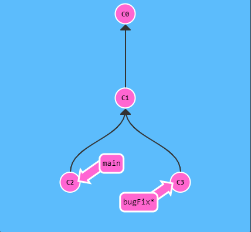   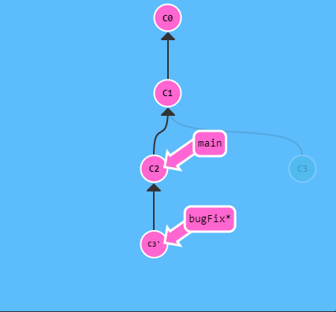

main分枝没有更新，现在更新main分枝。切换到main分枝(’git checkout main‘)，执行‘git rebase bugFix'，结果如图所示：
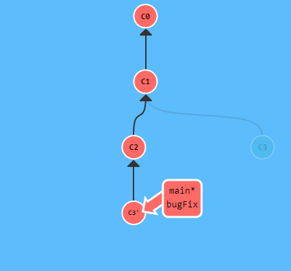

# 高级篇
***


### 1. 分离HEAD

HEAD是一个对当前检出记录的符号引用，也就是指向你正在其基础上进行工作的提交记录。HEAD总是指向当前分枝上最近一次提交。

示例： 执行' git checkout C1; git checkout main; git commit; git checkout C2;'

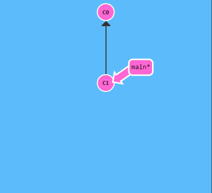

如果想看 HEAD 指向，可以通过 cat .git/HEAD 查看， 如果 HEAD 指向的是一个引用，还可以用 git symbolic-ref HEAD 查看它的指向。

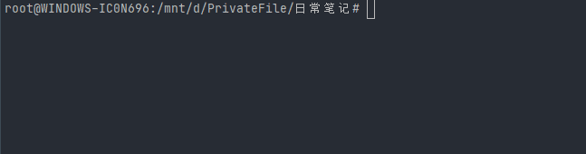

分离HEAD ('HEAD -> master' 变为 'HEAD master'), HEAD指向master,master指向'115067e'变成HEAD指向'115067e',master指向'115067e'

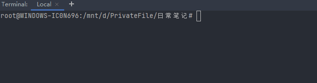

### 2. 相对引用

* 使用 '^'向上移动一个提交记录
* 使用 '^<num>'向上移动<num>个提交记录，如 '^3'

```shell
git checkout main^
```

* 使用 '~'直接向上移动一个提交记录
* 使用 '~<num>'向上移动<num>个提交记录，如 '~3'

```shell
git checkout HEAD~3
```

### 3. 撤消操作

git reset

```shell
git reset HEAD~1
```
执行'git reset HEAD~1' ,如图所示，main分枝移动到C1，本地代码库此时不知道有C2这个提交，但实际C2变更还在，但处于未加入暂存区状态。 
  
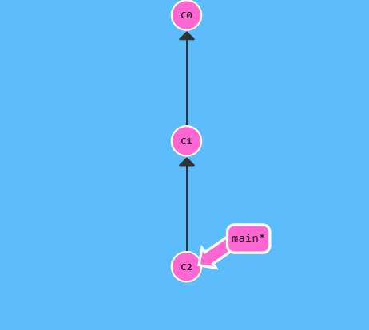

git revert

```shell
git revert HEAD
```

执行'git revert HEAD' 如图所示，会有新的提交C2',C2'是撤销C2的改变的，等同于C1，这样可以将更改推到远程仓库，分享给其他人。


git restore <file> 放弃当前未加入暂存区的文件的修改。

# 移动提交记录
***

### git cherry-pick

```shell
git cherry-pick <提交hash>
```
如果想将一个提交复制到当前所在的位置(HEAD)下面的话，使用cherry-pick是最好的方式。

执行'git cherry-pick c2 c4' ,将side分枝上c2,c4复制到main的c5提交下面。

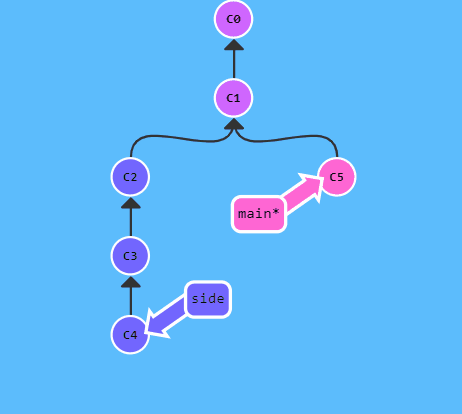


### 交互式的rebase

```shell
git rebase -i HEAD~4
```
可以对提交的最新的4个记录进行整理（删除、改变提交记录 ）

删除当前分支上的'6f0368c'提交记录

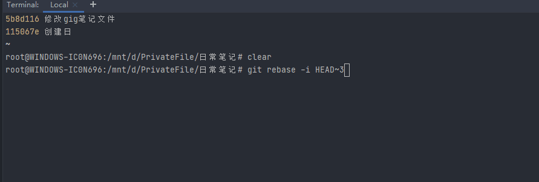

# 杂项
***

### 只取一个提交记录

场景1： 我们正在解决某个棘手的bug,为了方便调试而在代码中添加了一些调试命令并向控制台打印一些信息。这些调试和打印语句都在它们各自的提交记录里。
最终我终于找到造成这个bug的原因，j最后就差把bugFix里的工作合并回main分枝。

要想完成上面场景，可以使用复制节点命令，复制修复bug的提交。具体的命令入下：
```shell
git rebase -i 
git cherry-pick
```
执行'git checkout main, git cherry-pick c4'.

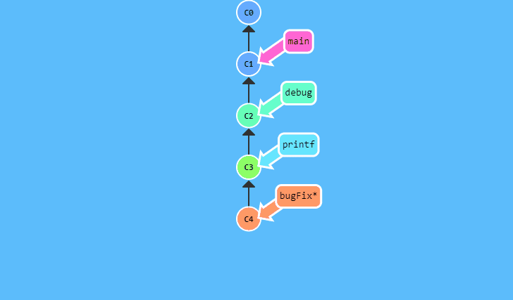

### 提交的技巧#1

场景2 在之前的newImage 分枝上进行了一个提交，然后又基于它创建分枝caption分枝，然后又提交了一次。此时你想对以前的提交记录进行小小的调整，比如newImage的图片分辩率。

可以执行：

> 先用 'git rebase -i '将提交重新排序，然后把我们修改的提交记录挪到前面。
> 然后用'git commit --amend' 来进行一些小修复。
> 接着再用 'git rebase -i '将他们调回原来的顺序。
> 最后我们把main移到修改的最前面。
  
  

执行'git rebase -i HEAD\~2' 调整 c2 ,c3顺序
执行'git commit --amend ' 修复，进行小提交。
执行'git rebase -i HEAD\~2' 调整 c3 ,c2 顺序。
执行'git checkout main' 切换到main分枝 。
执行'git merge caption' 将caption分枝merge到main分枝。

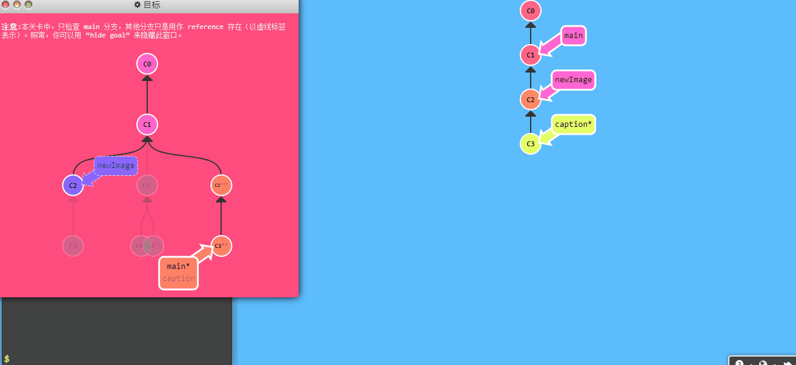

### 提交技巧#2

执行'git checkout main ,git cherry-pick c2' 切换分枝到main 复制c2到main分枝。
执行'git commit --amend' 修复，进行小提交。
执行'git cherry-pick c3' 复制c3到main分枝下。

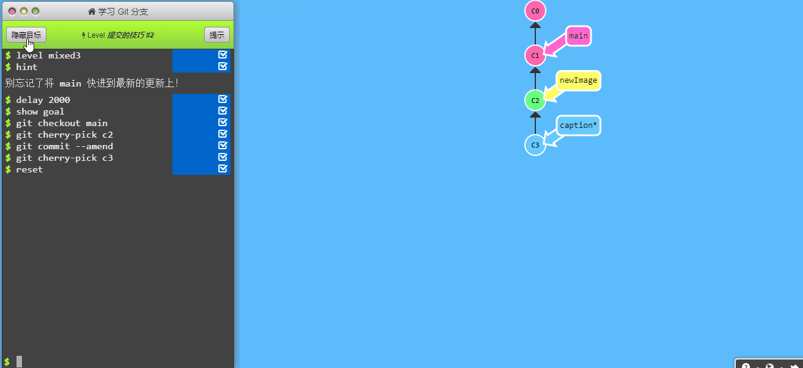

### git tag

tag 永远指向一个提交不会改变，就像提交上的一个锚点。

执行'git tag v1 c1' 给c1提交打个v1的标签。如果不指c1，则tag会打到HEAD指向的提交记录。

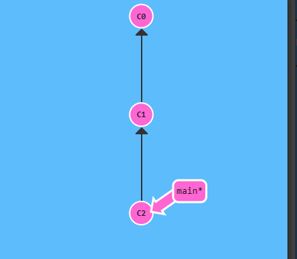

### git describe

用来描述离你最近的锚点(也就是标签),语法'git describe <ref>' 输出结果 '<tag>_<numCommits>_g<hash>' tag 表示的是离 ref 最近的标签， numCommits 是表示这个 ref 与 tag 相差有多少个提交记录， hash 表示的是你所给定的 ref 所表示的提交记录哈希值的前几位。

如图所示的提交树，执行'git describe main' 输出 'v1_2_gc2' , 'git describe side' 输出 'v2_1_gc4'

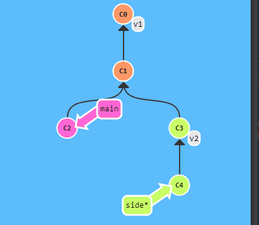

#高级话题
***

#### 多次rebase操作

使用多次rebase操作整理提交到一条提交线。

执行'git rebase main bugFix'将bugFix的提交c2合并至main下。
执行'git rebase bugFix side'将side的提交c4,c5,c6合并到bugFix下。
执行'git rebase side another'将another的提交c7合并至side分枝下。
执行'git rebase another main 将main分枝移来动至another分枝。

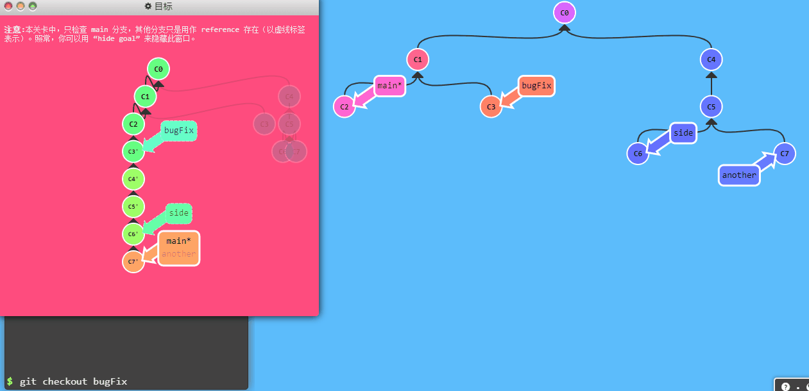

### 两个父节点

操作符 ^ 与 \~ 符一样，后面也可以跟一个数字。 但是该操作符后面的数字与 \~ 后面的不同，并不是用来指定向上返回几代，而是指定合并提交记录的某个父提交。还记得前面提到过的一个合并提交有两个父提交吧，所以遇到这样的节点时该选择哪条路径就不是很清晰了。 Git 默认选择合并提交的“第一个”父提交，在操作符 ^ 后跟一个数字可以改变这一默认行为。

执行'git checkout main^'将HEAD移到main的第一个父节点。

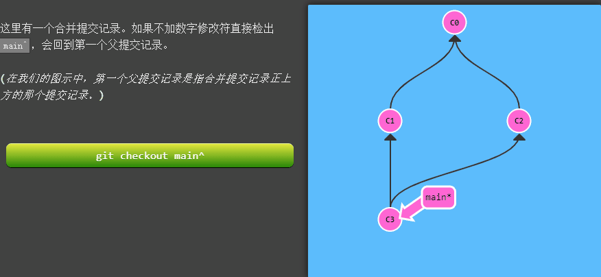

执行'git checkout main^2'将HEAD移动到main的第二个父节点。

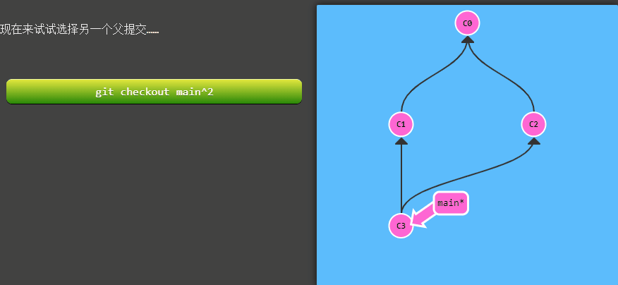

使用^与~快速移动

执行'git checkout HEAD~;git checkout HEAD^2; git checkout HEAD~2'移动到c3。也可以进行链式操作'git checkout HEAD~^2~2'
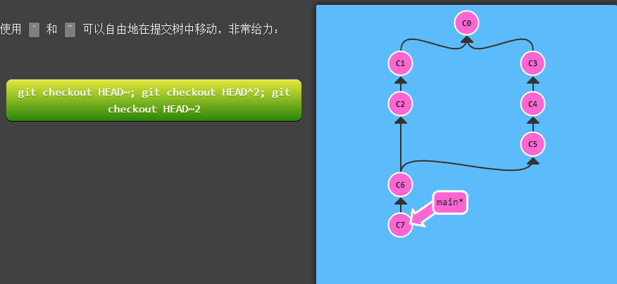

执行'git branch bugWork HEAD~^2~'移动后在c2上创建分枝bugWork。

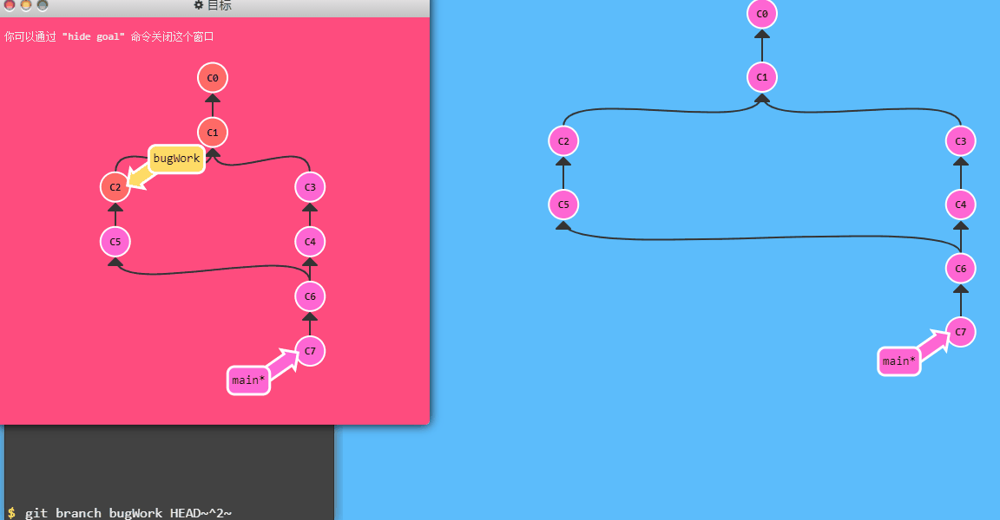

### 分枝移动复杂处理
执行’
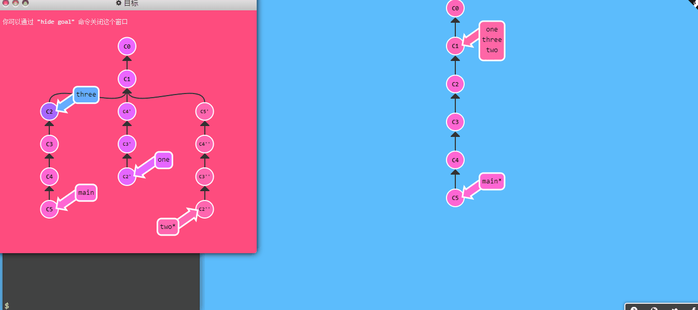


